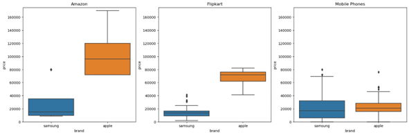
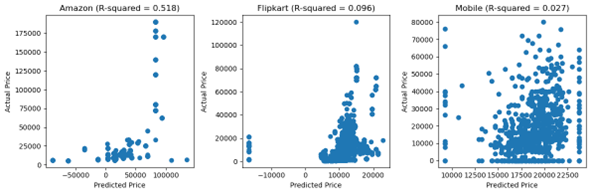

##  From Web Scraping to Database Management: A Comprehensive Study of Mobile Phone Data Analysis

### Project Summary

The rise of e-commerce has changed the way people shop for electronics products such as smartphones, and this has led to a need to identify the factors that influence online purchases. In this analysis, we aim to determine what attracts customers to buy smartphones online and on what criteria they make their purchases from e-commerce websites. We will use machine learning models such as linear regression to analyze the relationship between the dependent and independent variables. We will also seek to identify the market dominance of each brand in the e-commerce arena, and draw conclusions based on actual and predicted values with respect to prices and reviews of each product. The data highlights the impact of bad reviews on market growth and how e-commerce websites can be affected. We have collected data from three main smartphone websites using web scraping techniques, and have used different algorithms to analyze their results. Overall, the study provides insights into the factors that influence online smartphone purchases and identifies the best e-commerce websites in the market.

### Requirements for Running code access databases:
1. For creating a connection to MySQL, user and password should be root:root
2. For running jupyter notebook, dataset and code file should be on same location.

### Methodologies

The process of collecting mobile phone data involved web scraping and using public datasets, which were then converted into a pandas Dataframe and stored in MongoDB, a NoSQL database. The data cleaning process involved removing duplicates, handling missing values, and ensuring consistency across the data. The cleaned data was then loaded into a structured database, MySQL, using Python libraries like pymysql and SQLAlchemy. The data was organized into three tables, representing different aspects of the data. Finally, data analysis was performed using matplotlib and seaborn libraries, which involved creating visualizations like bar charts and scatter plots to gain insights into the distribution of mobile phones across different features. Github was used for collaboration and version control during the project.

### Result and Conclusion
The study compared smartphone data from three sources: mobile data, Amazon, and Flipkart, focusing on the market leaders Samsung and Apple. 

The study found that Apple prices were generally higher than Samsung prices, possibly due to increased demand, labor costs, and tariffs on imported components. Samsung offers more phone options, catering to a wider range of customers with varying budgets, which also impacted their average ratings. Ratings on Amazon showed a correlation with prices, indicating that customers value higher-rated smartphones and are willing to pay more for them. Apple devices were perceived as slightly higher quality, but the difference was not significant enough to sway customers. Linear regression was used to predict phone prices based on the number of reviews and ratings, indicating a good start for this task. The study highlights the importance of marketing analysis for smartphone companies to understand demands, components, and pricing strategies for profit. The dominant players in the Indian smartphone market were Samsung and Apple, with Motorola and Nokia also significant.

The final goal was to predict phone’s prices based on the number of reviews and on the ratings, which can have some correlation, according to the prices versus ratings chart. The technique applied was linear regression. For the current Amazon dataset, the prices show a linear correlation with the rating and reviews with R-squared equals to 0.518 which is shown in the above image.
